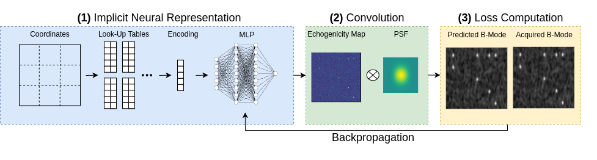

# PHOCUS: Physics-Based Deconvolution for Ultrasound Resolution Enhancement
### [Pre-Print](https://arxiv.org/abs/2408.03657)

[Felix Duelmer](https://www.cs.cit.tum.de/camp/members/felix-duelmer/)<sup>1,2,3</sup>,
[Walter Simson](https://waltersimson.com/)<sup>4</sup>,
[Mohammad Farid Azampour](https://www.cs.cit.tum.de/camp/members/mohammad-farid-azampour/)<sup>1,2</sup>,
[Magdalena Wysocki](https://www.cs.cit.tum.de/camp/members/magdalena-wysocki/)<sup>1,2</sup>,
[Angelos Karlas](https://scholar.google.com/citations?user=_LVqCgQAAAAJ&hl=en)<sup>1,5</sup>,
[Nassir Navab](https://www.cs.cit.tum.de/camp/members/cv-nassir-navab/nassir-navab/)<sup>1,2</sup>,
 
 <sup>1</sup>Technical University of Munich, Munich, Germany, <sup>2</sup>Munich Centre for Machine Learning, Munich, Germany, <sup>3</sup>Helmholtz Centre Munich, Neuherberg, Germany,  <sup>4</sup>Stanford University, Stanford, USA, <sup>5</sup>German Centre for Cardiovascular Research, Munich, Germany <br>
Stanford University


This is the official implementation of the paper "PHOCUS: Physics-Based Deconvolution for Ultrasound Resolution Enhancement".

## Pipeline



## Getting Started

You can install the required Python dependencies like this:

```bash
conda env create -f env.yml
conda activate phocus
```

## Reproducing results

The hyperparameters set in the config files can be used to reproduce the results from the paper. The data from the paper can be found under data/

Run the program with this command:

```bash
python3 run_nerf.py --config configs/conf_cirs_synthetic_wires.txt
```

## Citation 

Will be updated soon.

```Bibtex
@inproceedings{duelmer2024phocus,
  title={PHOCUS: Physics-Based Deconvolution for Ultrasound Resolution Enhancement},
  author={Duelmer, Felix and Simson, Walter and Azampour, Mohammad Farid and Wysocki, Magdalena and Karlas, Angelos and Navab, Nassir},
  booktitle={Annual Conference on Medical Image Understanding and Analysis},
  organization={Springer}
}
```

## Acknowledgments

Large parts of the code are from the [HashNeRF-pytorch](https://github.com/yashbhalgat/HashNeRF-pytorch) implementation. See [ACKNOWLEDGEMENTS](ACKNOWLEDGEMENTS).